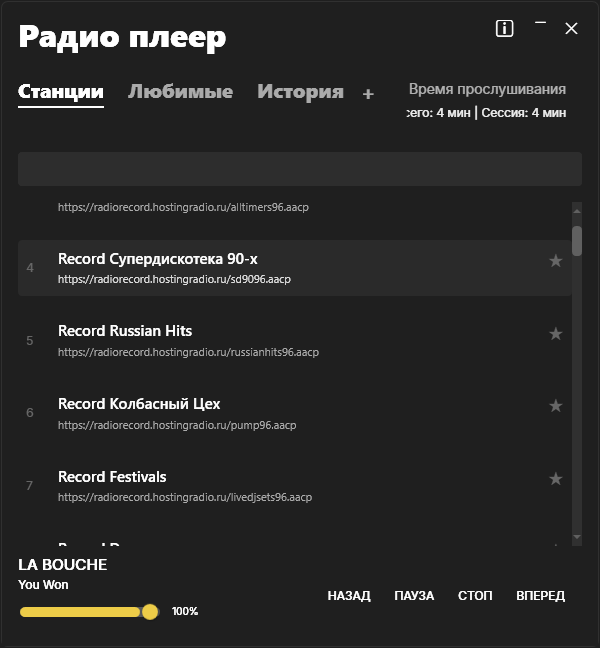
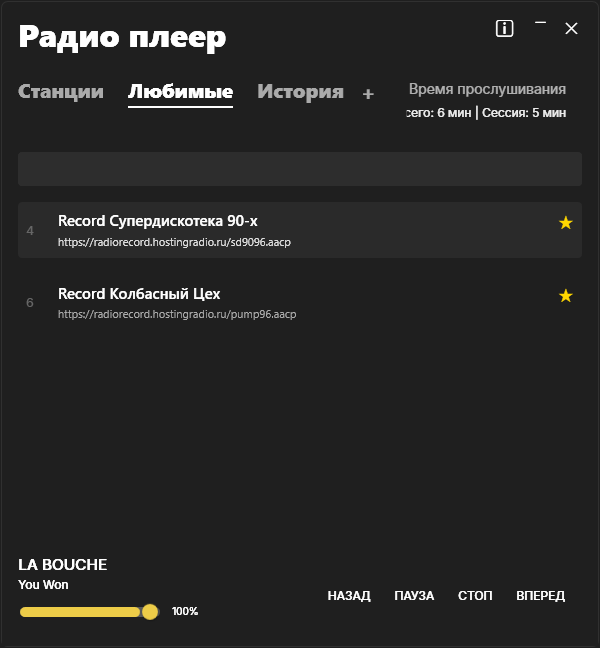
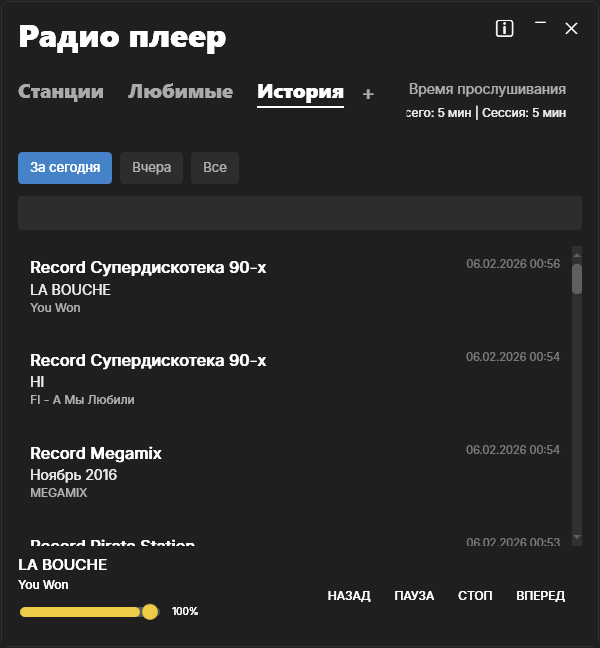

# 📻 Radio Player

| [EN](#en) | [RU](#ru) |
| :---: | :---: |

| Main | Favorites | History |
| :---: | :---: | :---: |
|  |  |  |

## EN
Minimalist WPF radio player with BASS.
- **Features**: Real-time tags, Favorites, History, System tray.
- **Run**: Install [.NET 8](https://dotnet.microsoft.com/download/dotnet/8.0), download [Release](https://github.com/difome/WpfRadioPlayer/releases), run `RadioPlayer.exe`.
- **Tech**: .NET 8, BASS.

## RU
Легкий WPF радио-плеер на базе BASS.
- **Фишки**: Теги в реальном времени, Избранное, История, Трей.
- **Запуск**: Установить [.NET 8](https://dotnet.microsoft.com/download/dotnet/8.0), скачать [Релиз](https://github.com/difome/WpfRadioPlayer/releases), запустить `RadioPlayer.exe`.
- **Стек**: .NET 8, BASS.

---
*By difome & Antigravity*
